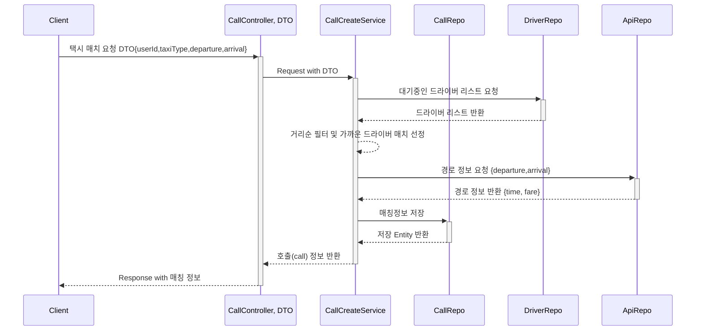

```mermaid
sequenceDiagram
    participant Client as Client
    participant CallController as CallController, DTO
    participant CallCreateService as CallCreateService
    participant CallRepo as CallRepo
    participant DriverRepo as DriverRepo
    participant ApiRepo as ApiRepo

    Client ->>+ CallController: 택시 매치 요청 DTO{userId,taxiType,departure,arrival}

    CallController ->>+ CallCreateService: Request with DTO

    CallCreateService ->>+ DriverRepo: 대기중인 드라이버 리스트 요청
    DriverRepo -->>- CallCreateService: 드라이버 리스트 반환

    CallCreateService -->> CallCreateService: 거리순 필터 및 가까운 드라이버 매치 선정
    CallCreateService ->>+ ApiRepo: 경로 정보 요청 {departure,arrival}
    ApiRepo -->>- CallCreateService: 경로 정보 반환 {time, fare}

    CallCreateService ->>+ CallRepo: 매칭정보 저장
    CallRepo -->>- CallCreateService: 저장 Entity 반환
    
    CallCreateService -->>- CallController: 호출(call) 정보 반환

    CallController -->>- Client: Response with 매칭 정보
```